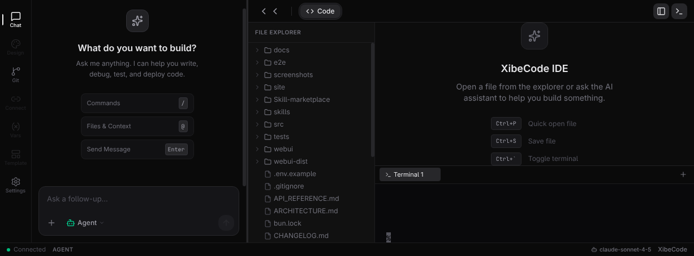
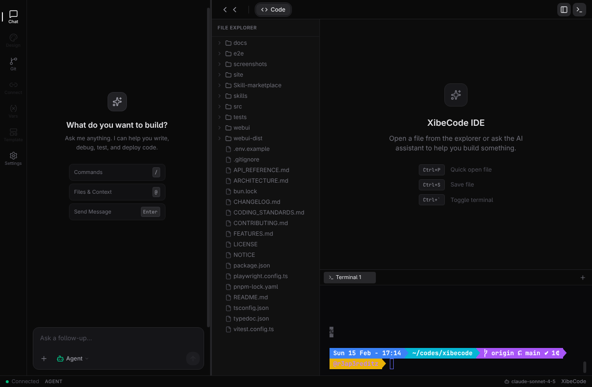
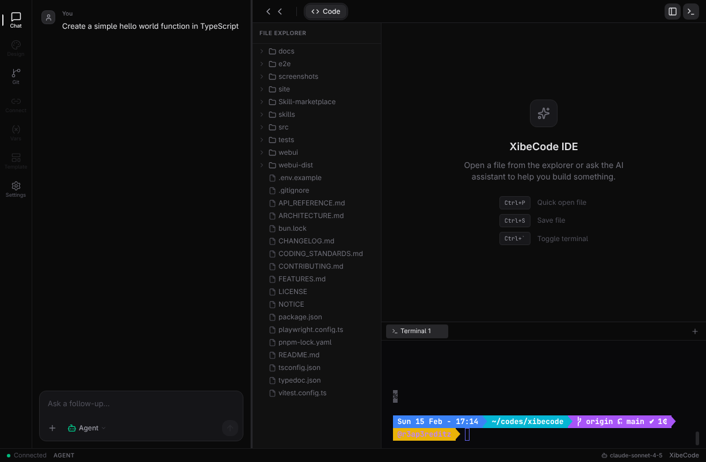
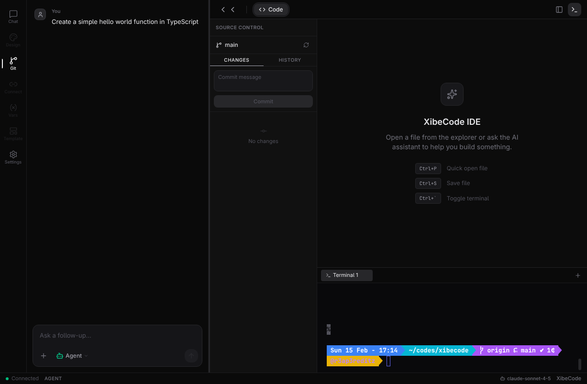
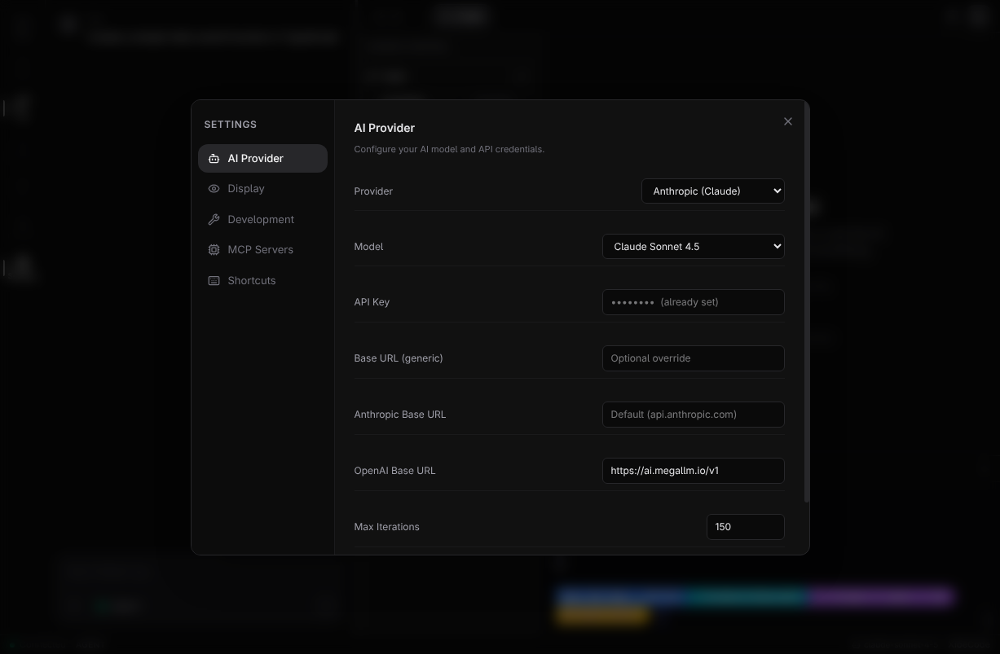
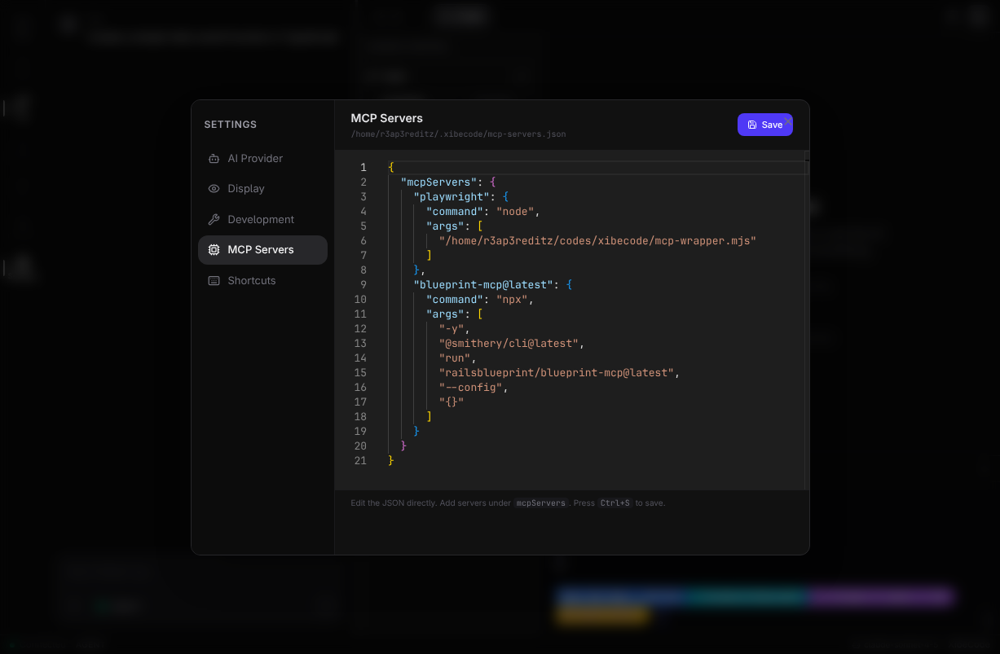

# XibeCode

AI-powered autonomous coding assistant for your terminal, browser, and desktop.

[](https://www.anishkumar.tech/donate)
[](https://www.npmjs.com/package/xibecode)
[](https://github.com/iotserver24/xibecode/releases)

## Overview

XibeCode is a CLI agent that can read and edit code, run commands, and iterate on tasks from your terminal using LLMs. It includes a **WebUI** for a browser-based experience, a **Desktop App** (Electron) for native IDE-like usage, **AI-powered test generation**, and **multi-model support** for both Anthropic and OpenAI models.

## What's New in v0.9.1

### Reliability and anti-hallucination upgrades

- **Evidence-aware completion gate**: the agent now requires grounded signals before declaring a task complete.
- **Post-edit verification**: write/edit operations are validated with read-back checks to reduce silent bad edits.
- **Improved loop resistance**: canonicalized loop detection blocks repeated or low-variation command/tool loops.
- **Safer memory recall**: recalled memories are labeled as unverified hints and filtered by minimum relevance score.
- **Grounded context compaction**: old context now keeps a **Grounded Facts Ledger** + conversation summary instead of blind truncation.

### Better chat UX and tool transparency

- **Large transcript retention** in terminal chat (much less history loss during long sessions).
- **Token-aware auto compaction** around large context budgets (near 120k token estimate) instead of fixed message-count trimming.
- **Richer tool rendering** in chat: tool call arguments and result summaries are shown for better observability.
- **Improved Markdown rendering** for assistant output in the TUI.

### Model and provider improvements

- **`/model` picker refresh** with provider/base-url-aware model loading.
- **`/format` command** to switch request wire format (`auto`, `anthropic`, `openai`) and persist it.
- Continued support for Anthropic, OpenAI-compatible providers, Gemini, and custom endpoints.

### CI and release workflow hardening

- **GitHub Actions reliability fixes** for TypeScript + dependency install paths.
- **No bundled Playwright** — browser automation is via optional `agent-browser` / MCP; npm install does not pull browser binaries.
- **Type declarations for `marked-terminal`** included in source to prevent clean-CI type failures.

## Screenshots

### Main Interface


*Modern v0.dev-inspired interface with activity bar, chat panel, code editor, and terminal*

### File Explorer


*Browse and open files with recursive directory tree*

### Chat Interface


*Interactive AI chat with streaming responses and markdown rendering*

### Git Panel


*Git integration with commit history, staging, and diffs*

### Settings Panel


*Comprehensive settings modal with multiple configuration categories*

### AI Provider Settings


*Configure AI models, API keys, and provider settings*

### MCP Servers Editor


*Edit MCP server configuration with Monaco editor and syntax highlighting*

### Terminal View


*Fully interactive terminal with PTY support, colors, and tab completion*

## Desktop App

Download the native desktop app for your platform from [GitHub Releases](https://github.com/iotserver24/xibecode/releases):

| Platform | Architecture | Download |
|----------|-------------|----------|
| **Windows** | x64 / arm64 | `.exe` installer |
| **macOS** | Intel / Apple Silicon | `.dmg` |
| **Linux** | x64 | `.deb`, `.rpm`, `.AppImage` |
| **Linux** | arm64 | `.deb`, `.rpm`, `.AppImage` |

The desktop app is a thin shell that runs the `xibecode` CLI underneath. Install the CLI first, then the desktop app gives you a native window with:

- VS Code-style welcome screen with recent projects
- Open Folder / Clone Repository / New Project
- Full XibeCode WebUI in a native window
- CLI updates automatically propagate (no app update needed)

## Installation

### CLI (required)

```bash
npm install -g xibecode
```

From source:

```bash
git clone https://github.com/iotserver24/xibecode
cd xibecode
pnpm install
pnpm run build
npm link
```

## Requirements

- Node.js 18+
- API key from Anthropic or OpenAI

**Platforms:** CLI and WebUI run on Linux (x64, ARM64), macOS (Intel, Apple Silicon), and Windows. For servers, Docker, or Raspberry Pi, use headless runs: `xibecode run` / `xibecode run-pr` with env-based config (no TUI). See [DOCS.md](DOCS.md#platforms-and-devices) for the full device matrix.

## Quick Start

```bash
# Configure once
xibecode config --set-key YOUR_API_KEY

# Interactive terminal mode
xibecode chat

# Open WebUI in browser (recommended for beginners)
xibecode ui --open

# Autonomous run
xibecode run "Create an Express API with auth"
```

## Main Commands

### `xibecode ui`

**NEW** - Start the WebUI in your browser.

```bash
xibecode ui              # Start on localhost:3847
xibecode ui --open       # Auto-open browser
xibecode ui -p 8080      # Custom port
```

Features:

- **v0.dev-style Layout** - Activity bar (left) → Chat panel (resizable) → Code editor (right)
- **Monaco Code Editor** - Professional code editor with syntax highlighting and IntelliSense
- **File Tree Explorer** - Browse and open project files with recursive directory tree
- **Multi-Terminal Tabs** - Create/manage multiple shell sessions with + and X buttons
- **Real PTY Terminal** - Fully interactive bash/zsh with colors, tab-completion, vim/nano support
- **Git Integration** - Commit history graph, stage/unstage files, view diffs, write commits
- **Settings Modal** - Configure AI provider, display preferences, dev tools, and MCP servers
- **MCP JSON Editor** - Edit mcp-servers.json directly with Monaco syntax highlighting
- **Custom Models** - Add any AI model (Claude, GPT-4, DeepSeek, Llama) via dropdown + text input
- **Real-time Chat** - Streaming AI responses with markdown rendering
- **Status Bar** - Connection status, current mode, active AI model, cursor position
- **Resizable Panels** - Drag the divider between chat and code areas to adjust layout
- **Slash Commands** - Type `/` for commands and mode switching, `@` for file references
- **New Chat Button** - Clear conversation with + button in chat input

### `xibecode run`

Autonomous coding workflow.

```bash
xibecode run "Build a REST API with Express"
xibecode run "Fix the TypeScript errors" --verbose
xibecode run --file task.txt
```

Options:

- `-f, --file <path>` prompt from file
- `-m, --model <model>` model override
- `--mode <mode>` initial agent mode
- `-b, --base-url <url>` custom API URL
- `-k, --api-key <key>` API key override
- `--provider <provider>` `anthropic` or `openai`
- `-d, --max-iterations <number>` default `150` (`0` = unlimited)
- `-v, --verbose`
- `--cost-mode <mode>` `normal` or `economy` (use cheaper model and lower iteration caps to save API cost)
- `--dry-run`
- `--changed-only`

### `xibecode run-pr`

Autonomous coding **with automatic branch + GitHub PR creation**. The command:

1. Runs the full agent task (same as `run`)
2. Executes your project's test suite for verification
3. Creates a new branch (`xibecode/<slug>-<timestamp>` by default)
4. Commits + pushes the branch to `origin`
5. Opens a PR against the remote default branch via the GitHub CLI (`gh`)
6. Prints the PR URL and exits

The PR description now includes task summary, per-file changes rationale (diff-based), run stats (iterations/tool calls and token/cost when available), and verification results (test command + pass/fail + duration, including any self-correction retries). In `--cost-mode economy`, explanation is budgeted and may fall back to file + `+/-` counts.

**Prerequisites:**

- [`gh` (GitHub CLI)](https://cli.github.com/) must be installed and authenticated:

  ```bash
  gh auth login
  ```

**Usage:**

```bash
xibecode run-pr "Fix the TypeScript errors in src/core/agent.ts"
xibecode run-pr "Add input validation" --verbose
xibecode run-pr "Refactor utils" --branch feat/refactor-utils --draft
xibecode run-pr --file task.txt --skip-tests
```

Options:

- `-f, --file <path>` prompt from file
- `-m, --model <model>` model override
- `-b, --base-url <url>` custom API URL
- `-k, --api-key <key>` API key override
- `--provider <provider>` `anthropic` or `openai`
- `-d, --max-iterations <number>` default `150` (`0` = unlimited)
- `-v, --verbose`
- `--cost-mode <mode>` `normal` or `economy` (save API cost)
- `--branch <name>` override generated branch name
- `--title <title>` override PR title
- `--draft` open PR as draft
- `--skip-tests` skip test verification before creating PR

**Example output:**

```
  ✅ Pull Request created successfully!

  PR URL: https://github.com/your-org/your-repo/pull/42
```

### `xibecode chat`

Interactive terminal chat + tool use.

Options:

- `-m, --model <model>`
- `-b, --base-url <url>`
- `-k, --api-key <key>`
- `--provider <provider>`
- `--cost-mode <mode>` `normal` or `economy`
- `--theme <theme>`
- `--session <id>`

### `xibecode config`

Manage saved config:

- `--set-key`, `--set-url`, `--set-model`, `--set-provider`
- `--set-cost-mode <mode>` set default cost mode: `normal` or `economy`
- `--set-economy-model <model>` model to use when cost mode is `economy`
- `--show`, `--reset`
- MCP helpers: `--list-mcp-servers`, `--add-mcp-server`, `--remove-mcp-server`

### `xibecode mcp`

MCP server management:

- `add`, `list`, `remove`, `file`, `edit`, `init`, `reload`
- `search`, `install`, `login` (Smithery integration)

## Core Features

- **Autonomous multi-step agent loop** - Completes complex tasks automatically
- **Smart context gathering** - Understands related files and imports
- **Verified and line-based editing** - Reliable code modifications
- **Dry-run mode** - Preview changes safely before applying
- **Git-aware workflows** - `--changed-only`, checkpoints, and reverts
- **Test runner integration** - Auto-detects Vitest, Jest, pytest, Go test
- **MCP server integration** - Extend capabilities with external tools
- **Skill system** - Built-in + custom markdown skills
- **Session-aware chat** - Persistent conversation history
- **Themed terminal UI** - Beautiful, customizable interface

## WebUI

The WebUI provides a browser-based interface that syncs in real-time with the terminal.

```bash
# Start with both TUI and WebUI
xibecode chat

# WebUI opens automatically at http://localhost:3847
```

### TUI-WebUI Sync

When you run `xibecode chat`, both interfaces are connected:

- Messages sent from **TUI** appear in **WebUI** (marked with "TUI")
- Messages sent from **WebUI** are processed by **TUI**
- Streaming responses show in both simultaneously
- Tool executions display in real-time

### Slash Commands (`/`)

Type `/` in the input to open the command palette:

**Commands:**

| Command | Description |
|---------|-------------|
| `/clear` | Clear chat messages |
| `/help` | Show available commands |
| `/diff` | Show git diff |
| `/status` | Show git status |
| `/test` | Run project tests |
| `/format` | Format code in project |
| `/reset` | Reset chat session |
| `/files` | List project files |

**Modes:**

| Mode | Icon | Description |
|------|------|-------------|
| `/mode agent` | 🤖 | Autonomous coding (default) |
| `/mode plan` | 📝 | Interactive planning with web research |
| `/mode tester` | 🧪 | Testing and QA |
| `/mode security` | 🔒 | Security analysis |
| `/mode pentest` | 🔓 | Penetration testing - run app and probe for vulnerabilities |
| `/mode review` | 👀 | Code review |
| `/mode team_leader` | 👑 | Coordinate team |

### File References (`@`)

Type `@` to browse and reference files:

- Shows project files and folders
- Filter by typing after `@`
- Select to include file path in message
- Helps AI understand which files to work with

### Settings Panel

Click the ⚙️ Settings button to configure:

- **Provider** - Anthropic, OpenAI, or Custom
- **Model** - Select from available models
- **Custom Model ID** - For custom/local models
- **API Key** - Your provider API key
- **Base URL** - Custom API endpoint (for local LLMs)
- **Session Info** - Working directory, git branch

### Features

- **Markdown Rendering** - Code blocks, bold, italic, lists, links
- **Tool Execution** - Shows each tool call with status (running/done/failed)
- **Thinking Indicator** - Spinner while AI is processing
- **Responsive Design** - Mobile-friendly layout and touch-friendly controls; works on phones, tablets, and desktop
- **Real-time Streaming** - See responses as they're generated

## AI Test Generation

XibeCode can automatically generate comprehensive test suites for your code:

```bash
# Via CLI (in chat mode)
> generate tests for src/utils/helpers.ts

# Via WebUI
1. Go to "Test Generator" tab
2. Enter file path
3. Select framework (auto-detected)
4. Click "Generate Tests"
```

### Features

- **Multi-framework support** - Vitest, Jest, Mocha, pytest, Go test
- **Code analysis** - Understands functions, classes, types
- **Edge case generation** - Null checks, empty strings, boundaries
- **Mock setup** - Automatic mock configuration
- **Type checking tests** - Verifies return types
- **Error handling tests** - Tests for exceptions

### Example Output

```typescript
import { describe, it, expect, vi } from 'vitest';
import { calculateTotal } from '../utils/helpers';

describe('calculateTotal', () => {
  it('should execute calculateTotal successfully', () => {
    expect(calculateTotal([])).toBeDefined();
  });

  it('should return correct type from calculateTotal', () => {
    expect(typeof calculateTotal([])).toBe('number');
  });

  it('should handle empty array', () => {
    expect(calculateTotal([])).toBe(0);
  });

  it('should handle errors in calculateTotal', () => {
    expect(() => calculateTotal(undefined)).toThrow();
  });
});
```

## Browser testing (no bundled browser)

XibeCode does **not** ship Playwright or download Chromium. Legacy tool names (`take_screenshot`, `preview_app`, etc.) return a short message pointing you to **`run_command` + [`agent-browser`](https://github.com/vercel-labs/agent-browser)** (already a dependency) or your **browser MCP**. For Playwright E2E, add `@playwright/test` to the **target project** and run it with `run_command` (for example `pnpm exec playwright test`).

## Configuration

### Environment Variables

```bash
ANTHROPIC_API_KEY=sk-ant-...     # Anthropic API key
OPENAI_API_KEY=sk-...             # OpenAI API key
XIBECODE_MODEL=claude-sonnet-4-5-20250929  # Default model
```

### Config File

Located at `~/.xibecode/config.json`:

```json
{
  "apiKey": "sk-ant-...",
  "model": "claude-sonnet-4-5-20250929",
  "provider": "anthropic",
  "maxIterations": 50,
  "theme": "default"
}
```

### Available Models

| Model | Provider | Best For |
|-------|----------|----------|
| `claude-sonnet-4-5-20250929` | Anthropic | General coding (default) |
| `claude-opus-4-5-20251101` | Anthropic | Complex reasoning |
| `claude-haiku-4-5-20251015` | Anthropic | Fast responses |
| `gpt-4o` | OpenAI | General coding |
| `gpt-4o-mini` | OpenAI | Fast responses |
| `o1-preview` | OpenAI | Complex reasoning |

## API

XibeCode provides a REST API when running the WebUI:

```bash
# Start the server
xibecode ui

# API endpoints
GET  /api/health          # Health check
GET  /api/config          # Get configuration
PUT  /api/config          # Update configuration
GET  /api/models          # List available models
GET  /api/project         # Get project info
GET  /api/git/status      # Get git status
GET  /api/git/diff        # Get git diff
POST /api/files/list      # List directory contents
POST /api/files/read      # Read file contents
POST /api/session/create  # Create chat session
POST /api/tests/generate  # Generate tests for file
POST /api/tests/analyze   # Analyze file for testable code
POST /api/tests/run       # Run project tests
```

## Project Structure

```text
xibecode/
├── src/
│   ├── core/           # Agent, tools, context
│   ├── commands/       # CLI commands
│   ├── utils/          # Config, git, safety
│   ├── tools/          # Test generator, browser
│   ├── webui/          # WebUI server
│   └── index.ts        # CLI entry point
├── site/               # Documentation site
└── tests/              # Test suites
```

## Dependency Map


## Project Docs

- `CHANGELOG.md` — release history
- `FEATURES.md` — feature deep dive
- `PUBLISHING.md` — npm release process

## Support

- [GitHub Issues](https://github.com/iotserver24/xibecode/issues)
- [Donate](https://www.anishkumar.tech/donate)

## License

Apache-2.0
